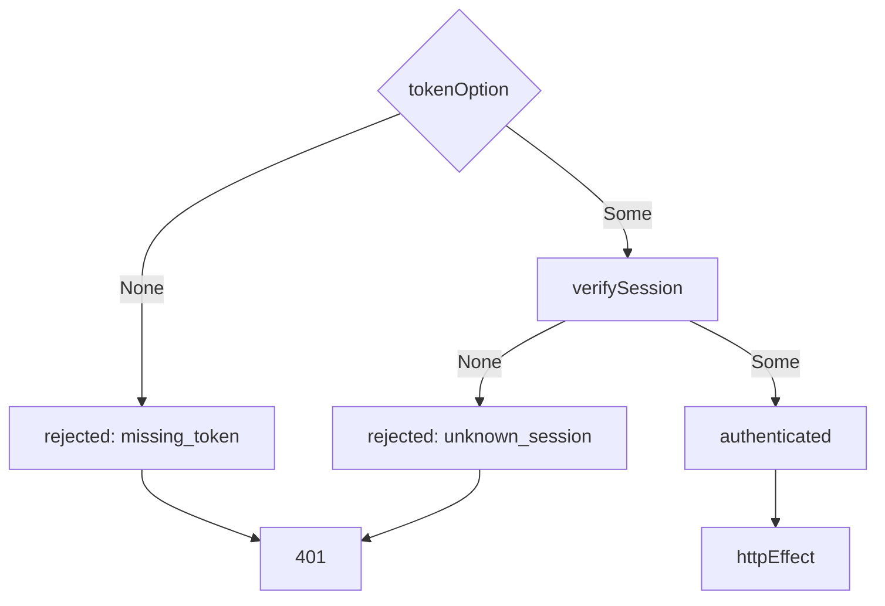

# Draft PR

Squash PR titles and descriptions for anyone reviewing the PR. One report holds the exhaustive
walkthrough, one tight description survives squash. The code is the source of truth; the title plus
description answers what a reviewer needs and decreases overload. After squash, `git log` alone
tells the end, the approach, and the risk.

## Process

Run these steps in order.

- **Analyze.** Read recent `git log` titles for the conventional commits style and whether scopes
  like `feat(scope):` are used, the request context for the Why, and the complete diff. When the
  project defines a ticket convention (e.g. `docs/agents/issue-tracker.md`), also read the given
  ticket link and use the project docs' format. Record the total `+N -M`, every file, and mark Why
  unknown when not grounded in ticket or context. Use only these sources. This step is complete when
  every changed file is recorded and the Why is marked known (sourced) or unknown.
- **Report.** Produce one squash report, no gates. Open with the whole churn
  `+500 -120 | the whole PR`. Then cover the user-facing Why, then semantic chunks in order business
  reason, approach, then mechanics. Note which flows changed and what test evidence exists so the
  optional blocks stay grounded. This step is complete when every changed file belongs to a chunk
  and each chunk states its `+N -M | %`, files and lines, load-bearing lines, key decisions with
  alternatives and tradeoffs, risks, and judgment calls like naming, scope cuts, inferred details,
  placement, and deliberate omissions. Include deferred work and assumptions. Include Related only
  when a project ticket convention applies and a ticket was given, in the project docs' format.
- **Propose.** Tighten the report into one squash title plus body using the template below. Keep
  detail in the report, not the description. This step is complete when the description is under 50
  lines and each semantic chunk maps to one bullet. Small PRs omit all optional blocks and stay
  under 15 lines. Show proposal together with the report.
- **Refine once.** Use the question tool once to ask: approve as-is, edit in your own words, or give
  revision notes. Offer approve and revise choices and always leave room for your own words. Apply
  feedback, tighten, show updated title plus body. Loop only if you provide revisions.
- **Reconcile.** Re-read the final diff and check every line of the description against it. Drop
  anything no longer present, add anything the change does that no chunk covered. Verify removal and
  rename claims with `grep` (e.g. a claimed schema field removal must show a deletion hunk); a claim
  with no supporting hunk is dropped, not reworded. When no ticket grounds the Why, label it plainly
  (`No ticket given; Why inferred from context:`) instead of writing it as fact. This step is
  complete when every claim is traceable to the final diff or to ticket or context.
- **Handoff.** Check which PR integration is available: an MCP integration for the host first, else
  the CLI tool for the host. Then load `references/github.md` when the PR lives on GitHub, or
  `references/azure-devops.md` for Azure Repos, and follow that file. If an existing PR is known ask
  whether to update it; if none exists ask whether to create one. Use the question tool for explicit
  confirmation before changing or creating anything. Report the actual result. If you decline,
  return the draft without an operation.

## PR description template

Title plus body that stand alone after squash. Exact order, no extra headers for the first three
parts:

1. **Title.** One line, conventional commits `feat:`, `fix:`, etc. with optional scope
   `feat(scope):` when it clarifies the area, imperative and specific enough to stand alone in
   `git log` after squash. Include scope only when it makes sense.
2. **Why, no header.** One to three sentences directly under the title. The user-facing problem, who
   or what it affects, and the intended outcome, grounded in ticket or context. Never a `Why`
   header.
3. **What changed, no header.** Bare bullets, one per semantic chunk, in the user's words when
   available. Behavior introduced, scope or boundaries, and user-visible result. Never a
   `What changed` header. One idea per bullet, one to two lines each.
4. **Optional blocks, in this order, each omitted unless it earns its place:**
   - **Flows.** Only when a reviewer needs call order or data flow. Pick the visual from
     `references/flows.md`. One visual per flow, two at most.
   - **Before/after.** Only for visual changes (direct or indirect) or benchmarks. Visual changes
     show a table of before and after with uploaded images or video. Benchmarks show a table of
     before (baseline from target branch) and after (candidate from the PR).
   - **Storytelling.** Only for impressive, difficult, high-risk, or wide-scoped changes. Blog style
     with context, narrative, code samples, and diagrams as needed.
   - **Test coverage.** What was tested and why it matters, grouped by risk or flow. Name the
     behavior covered and add a `because` clause for why that check earns trust. Never run logs or
     validation lists.
   - **Risks and follow-ups.** Concrete risks, assumptions, edge cases, rollout or compatibility
     concerns, work deliberately deferred.
   - **Related.** Last section, and only when the project defines a ticket convention and a ticket
     was given for this PR. Follow the project docs' format for the link and any close keywords;
     e.g. `[PROJ-123](https://tickets.example.com/PROJ-123)`. Omit the section entirely otherwise.

Worked example:

**Title.** `refactor: adopt Effect Match for branching with exhaustive checks`

Auth bearer flow used nested conditionals that hid the exhaustive cases. This change makes the valid
outcomes explicit so reviewers read the happy path first.

- Auth bearer flow is two exhaustive matches: token to `VerifyOutcome`, outcome to response.
- Request id fallback, span annotations, and session outcome match on `Option` tags.
- `stripPath` matches on `{ queryIndex, hashIndex }` shapes instead of nested `if`s.
- Standards and effect skill record when `Match` applies and when `Option` pipelines stay.

Bearer now reads as one pipeline:

## Body style

- Concise, never essays. Every line earns its place. Cut anything that does not help a stranger
  review the PR or understand the squash commit later. The description never grows just because the
  report did.
- Bullets stay concise with no filler openers (`This change adds...`, `In addition...`). No second
  sentence unless it carries new information. A header introduces two or more points, never a single
  sentence.
- Prefer the smallest visual that makes the point. Code samples and snippets (internals or sample
  usage) and code refs are allowed where they earn it. Keep one visual, two at most, never all of
  them. No visual for typo, copy, or single-line fixes.
- Every diagram needs a one-sentence lead-in that still reads when the diagram does not render, such
  as in `git log` or email.
- Describe only the final aggregate squash result. Omit intermediate PR meta such as size cuts
  between pushes or commit-to-commit refactors.
- Markdown only. Fenced code, call trees, file trees, `diff` blocks, and fenced `mermaid` blocks are
  allowed. Never use the `::: mermaid` container syntax.

## Conventions

- Use only `git log` titles, the request context, and the diff as sources for shape and scope, plus
  the ticket link when the project defines a ticket convention.
- Stay platform-agnostic by default and omit Related. When project docs define ticket linking, they
  override: follow their format for links and close keywords.
- Flag a simpler change when the code allows one.
- Skip anything the user spelled out.
- Include any extra context the user gave in the request.
