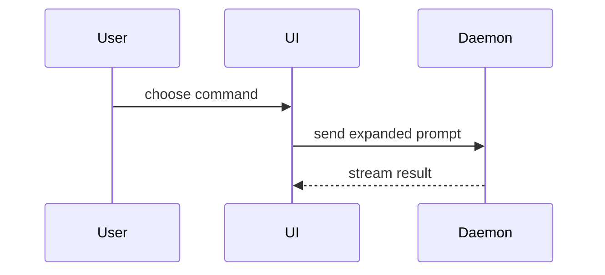

# Visual styles for PR Flows

Selection order and PR-scoped examples for the Flows section of a squash PR body. The squash body
survives as plain text in `git log` and email, so every visual must read without rendering. Markdown
only, no HTML artifacts.

## Selection order

First match wins. One visual per flow, two at most, never all of them.

1. One changed call path: indented call tree.
2. Branching or interaction across participants that ASCII cannot hold: Mermaid `sequenceDiagram`.
3. State or shape relationships: Mermaid `graph`.
4. UI hierarchy with state that matters: indented component tree.
5. File responsibility or moves: shallow file tree.
6. The point is what changed against a shape the reviewer knows: `diff` block.
7. New algorithm: pseudocode in a plain fenced block. Mostly-new block: show the whole block so
   ownership and order stay visible.

## Placement

Each visual sits next to the short text it supports, under a one-sentence lead-in that still makes
sense when the diagram does not render. Prune to the calls, files, props, states, and boundaries the
current change needs. Never merge unrelated flows into one visual; use two small ones or drop the
weaker.

## Mermaid subset

Standard fenced syntax, never the `::: mermaid` container. `sequenceDiagram` or `graph` only (never
`flowchart`), simple node labels, no HTML tags, no icons, no LongArrow `---->`. Renders in GitHub
and Azure DevOps Cloud pull requests.

## PR-scoped examples

Call tree, with a lead-in that survives plain text:

Restore runs before the first paint so the UI never flashes the default order:

```
loadReport
  restoreSortOrder
    readLocalStorage
  renderTable
```

`diff`-shaped call tree, when the point is what changed:

```
submitForm
  createSession
    persistPrompt
+   expandSkillMention
    launchAgent
-   navigateToSession
+   navigateToSession
+     subscribeToEvents
```

Interaction across participants, only when ASCII tangles:


